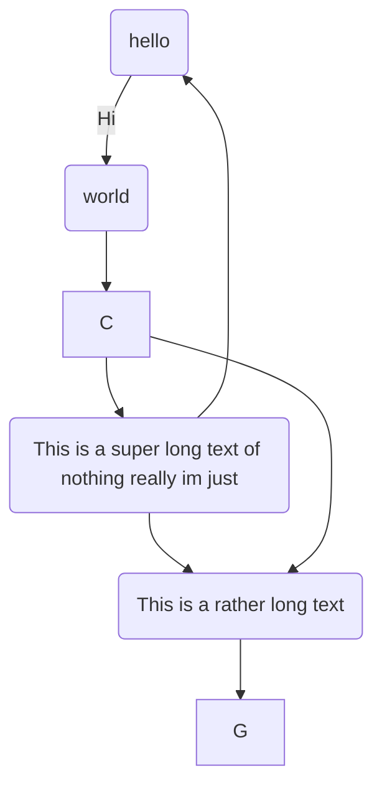

(@)  My first example will be numbered (1).
(@)  My second example will be numbered (2).

Explanation of examples.

(@)  My third example will be numbered (3).
Numbered examples can be labeled and referred to elsewhere in the document:

(@good)  This is a good example.

As (@good) illustrates, ...

The gravitational force

$$\vec{g}$$

The gravitational force

$$\mathbf{g}$$

And with some code:

~~~{.cpp .numberLines startFrom="1"}
class A {};
~~~